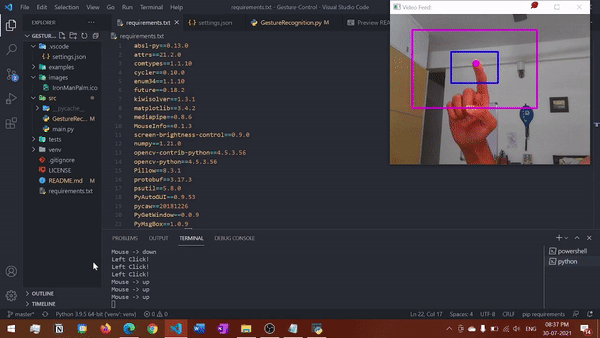
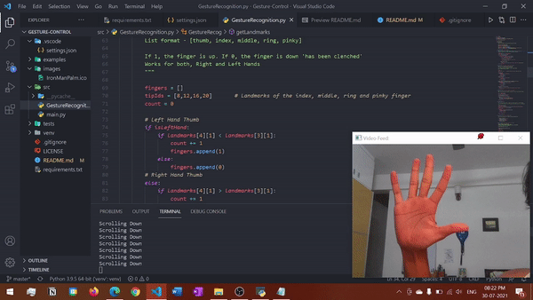
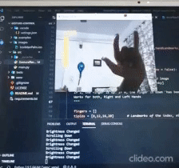
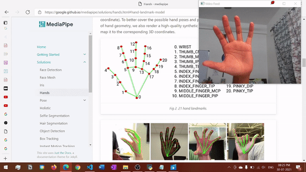

# Gesture-Control
Awesome OpenCV + Mediapipe project to change the volume/screen brightness, scroll, and control the mouse pointer - all with gestures!

 
Special thanks to <a href="https://github.com/vinamrak">Vinamra</a> bhaiya for the <a href="https://www.youtube.com/watch?v=SlqHa2R9RYg">foundation!</a>
 

 

### <u>Usage</u>

To download the Application <a href="#">Click Here</a> 
 
Run the project.exe file (iron man logo), and you're good to go :)
 
It is recommended that you run main.py directly from src, because the executable's performance is notably slow.

 

### <u>Features</u>

* <b>Mouse Control with Right Hand</b>

 

* <b>Scroll with Right Hand</b>

 

* <b>Brightness Control with Left Hand</b>

 

* <b>Volume Control with Right Hand</b>

 

* <b>Alt + Tab Simulation with Left Hand</b>

 
 

### <u>Installation (For Developers)</u>

For Windows - (Tested with Python 3.9.5)

After cloning the repo, run these commands in command prompt

Install the virtual environments package

    pip install virtualenv

Create a virtual environment with the name venv

    virtualenv venv

Activate the created virtual environment (use one of the two commands)

    .\venv\Scripts\activate.bat
    .\venv\Scripts\activate.ps1

Install the required packages

    pip install -r requirements.txt

If you are using VSCode, configure settings.json as follows

    {
        "python.pythonPath": ".\\venv\\Scripts\\python"
    }

 

### <u>Common Issues</u>

(Create separate file for this section) 
 
1) Webcam  
If the webcam doesn't work, pass 1 instead of 0 in the lines using cv2.VideoCapture()
as follows:
    
    capture = cv2.VideoCapture(1)

 

2) Mediapipe's Left Hand / Right Hand Classifier is not always accurate, which might lead to some incoherence

 

### <u>Compiling the Application (into an .exe file)</u>

First install auto-py-to-exe with

    pip install auto-py-to-exe

If you get the error - module enum has no attribute IntFlag,
uninstall auto-py-to-exe, then enum34 and reinstall the former

    pip uninstall auto-py-to-exe
    pip uninstall enum34
    pip install auto-py-to-exe

Now run auto-py-to-exe with

    pip install auto-py-to-exe.exe

Merge the code into a single file called project.py
Locate project.py in auto-py-to-exe
In the settings, choose
* One Directory
* Window Based (hide the console)

Choose the icon from the images folder (or use your own!)

In the 'Advanced Menu', go to paths, and paste the path to your Scripts folder present in venv

<b>Note!</b>
 
After compilation copy files from "venv\Lib\site-packages\mediapipe" 
into "output\mediapipe" present in the created project folder
 
This needs to be done because Mediapipe's files do not get automatically added.

 

### <u>Resources</u>

* https://google.github.io/mediapipe/solutions/hands.html

